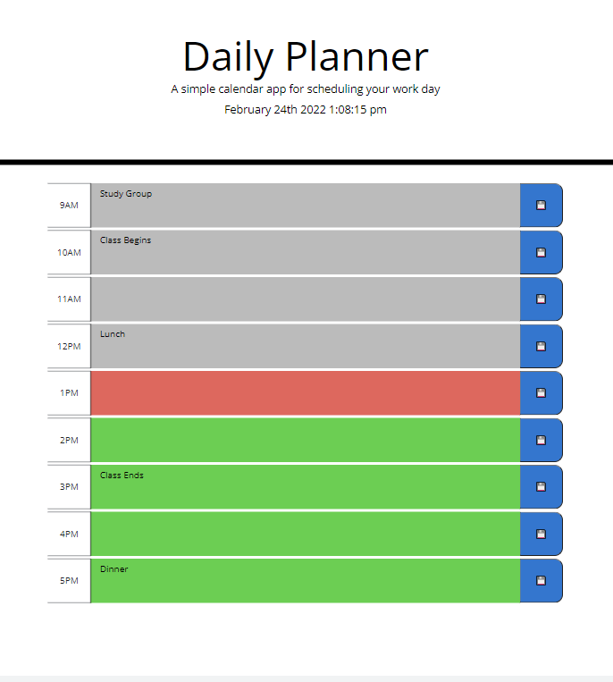

# Daily-Planner

I created a simple daily planner web app.  It allows you to enter text in hour blocks to keep track of your daily activities.  The daily planner displays the current time and highlights the current hour.  It also highlights past hour blocks in gray and future hour blocks in green.  

Once you enter in the information, you can click the save button to save any information in local storage.

## Link

The Daily Planner can be  located [here](https://bthalpin.github.io/Daily-Planner/)

## Media
The following image shows what the Daily Planner looks like: 

